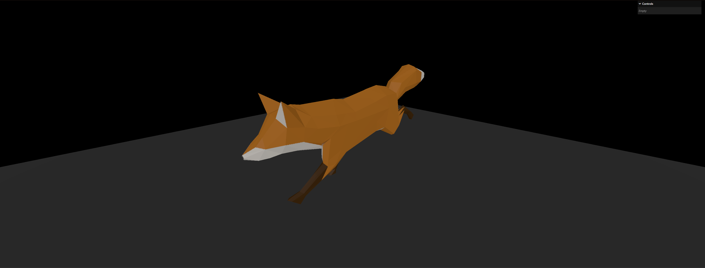

# Three.js Journey - Course by Bruno Simon
## 23 - Imported models
This exercise is about importing custom models into the scene and using their data / animations.
The page displays a running fox.
Within the code, the user is able to change the model to:
- A duck
- A flight helmet
- A fox
The user is also able to change the model's file format within the code:
- GLTF (default)
- GLTF-Binary
- GLTF-Draco
- GLTF-Embedded



### Setup instructions
Download [Node.js](https://nodejs.org/en/download/).
Run this followed commands:

``` bash
# Install dependencies (only the first time)
npm install

# Run the local server at localhost:8080
npm run dev

# Build for production in the dist/ directory
npm run build
```